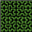
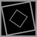
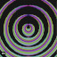
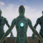

     .----------------.  .----------------.  .----------------. 
    | .--------------. || .--------------. || .--------------. |
    | |  ________    | || |  _________   | || |  ____  ____  | |
    | | |_   ___ `.  | || | |_   ___  |  | || | |_  _||_  _| | |
    | |   | |   `. \ | || |   | |_  \_|  | || |   \ \  / /   | |
    | |   | |    | | | || |   |  _|      | || |    > `' <    | |
    | |  _| |___.' / | || |  _| |_       | || |  _/ /'`\ \_  | |
    | | |________.'  | || | |_____|      | || | |____||____| | |
    | |              | || |              | || |              | |
    | '--------------' || '--------------' || '--------------' |
     '----------------'  '----------------'  '----------------' 

           DarknessFX @ https://dfx.lv | Twitter: @DrkFX

# UEMaterials - DarknessFX Collection of Unreal Engine Materials

## About

This is an easier way to share materials source code than screenshots on X account <a href="https://x.com/DrkFX" target="_blank">@DrkFX</a> and to keep a complete collection accessible to everyone. 

I'm currently using Unreal Engine 5.4.4, this materials maybe not open in earlier Unreal Engine versions.

## Gallery

Click on the material thumbnail to access the source code details.

## Additional information

**- Where do I copy the .uassets files ?**

I suggest to copy to your Project\Content folder (ex: C:\MyUEGame\Content\).

**- How do I use this files ?**

After you copy the .uassets to your Project\Content folder open you Content Browser, 
all this new materials and material function will show up. If not, just close and open 
your project again to refresh the engine.

**- I'm getting an error that MaterialFunction don't exist ?**

Make sure you copied the material function too (you can follow the twitter link to see a screenshot of the 
original material as reference) AND copy the .uassets files to your Project\Content folder first. 

Later inside the engine you can move the materials to your own custom folder structure like 
"\Content\Materials" and "\Content\Materials\MaterialsFunctions".

## Versions
- Materials from Jan/2023 forward are using UE 5.1 . 
- Materials from Jul/2023 forward are using UE 5.2.1 . 
- Materials from Nov/2023 forward are using UE 5.3.2 . 
- Materials from Sep/2024 forward are using UE 5.4.4. 

## Credits

celestialmaze <a href="https://twitter.com/cmzw_" target="_blank">@cmzw_</a>  
YukiYa <a href="https://twitter.com/ko_yuki_lo" target="_blank">@ko_yuki_lo</a>  
くろれきし <a href="https://twitter.com/endwar1338" target="_blank">@endwar1338</a>  
Xor <a href="https://twitter.com/XorDev" target="_blank">@XorDev</a>  
Unreal Engine from Epic Games - https://www.unrealengine.com/  

## License

@MIT - Free for everyone and any use.   
DarknessFX @ <a href="https://dfx.lv" target="_blank">https://dfx.lv</a> | Twitter: <a href="https://twitter.com/DrkFX" target="_blank">@DrkFX</a>  https://github.com/DarknessFX/UEMaterials

