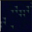

# <a href="..">UEMaterials</a>  - M_BackgroundAnim
 

<a href="../M_BackgroundAnim.uasset">M_BackgroundAnim</a> 

 
 

Post:
<a href="https://twitter.com/DrkFX/status/1682396937796943873">https://twitter.com/DrkFX/status/1682396937796943873</a>