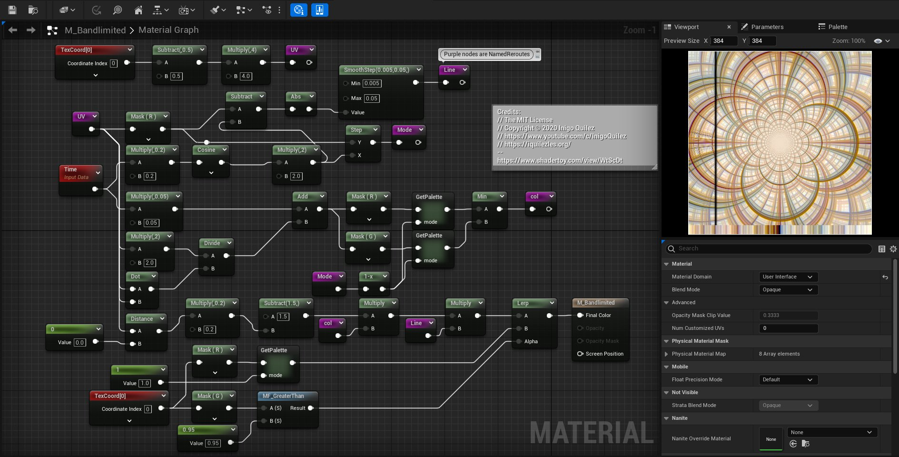
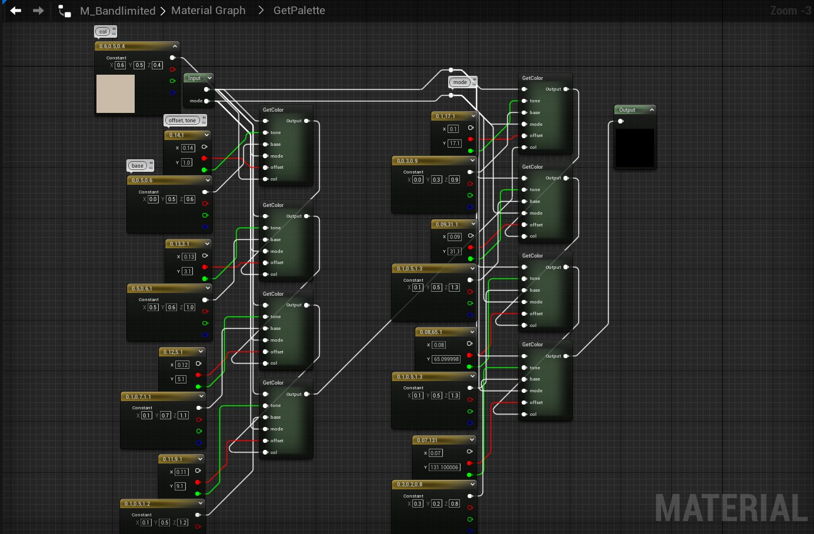
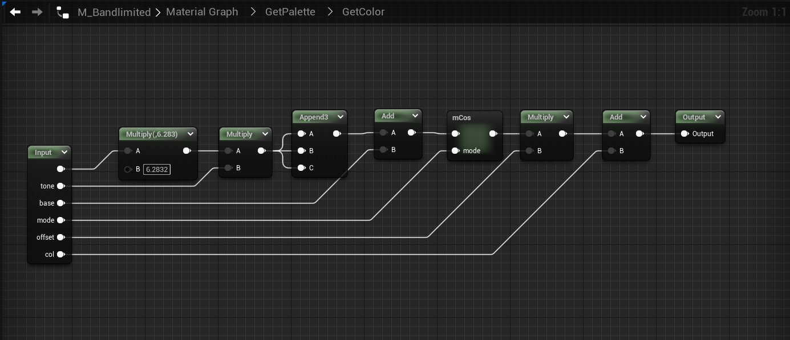
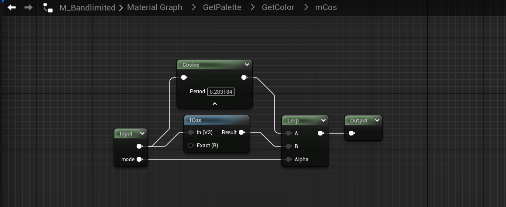
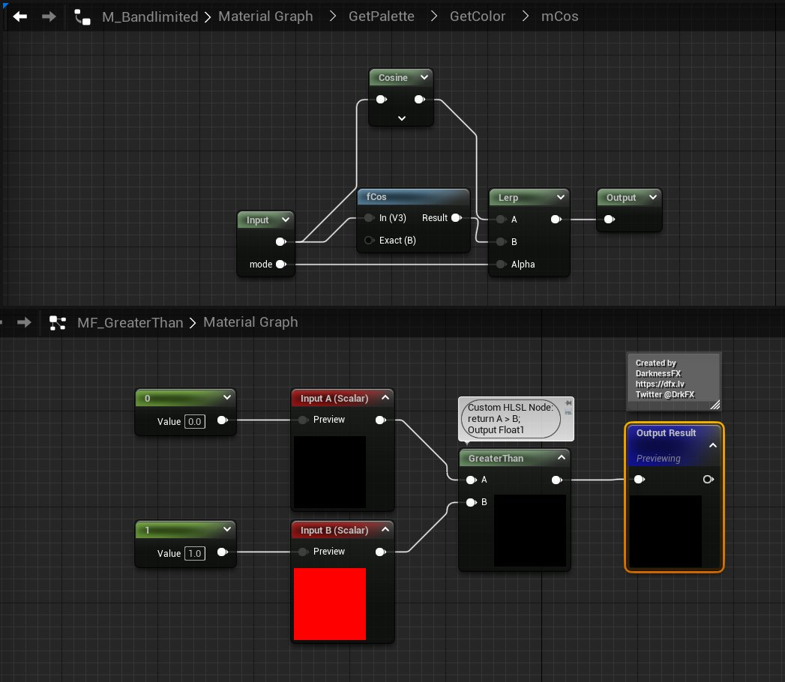
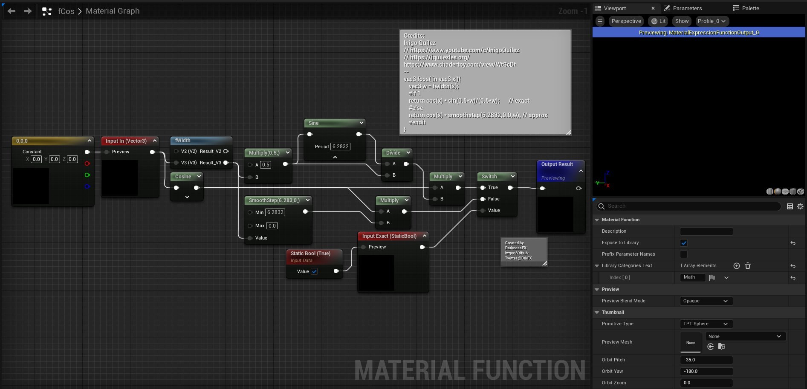
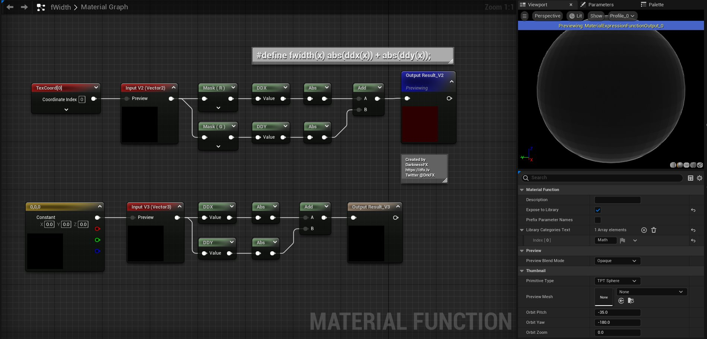

# <a href="..">UEMaterials</a> - M_Bandlimited
 

<a href="../M_Bandlimited.uasset">M_Bandlimited</a> 

 
 
 
 
 
 
 

Credits: 
// The MIT License 
// Copyright © 2020 Inigo Quilez 
// https://www.youtube.com/c/InigoQuilez 
// https://iquilezles.org/ 
-- 
<a href="https://www.shadertoy.com/view/WtScDt">https://www.shadertoy.com/view/WtScDt</a> 
 
Post: 
<a href="https://x.com/DrkFX/status/1635332970763673600">https://x.com/DrkFX/status/1635332970763673600</a> 