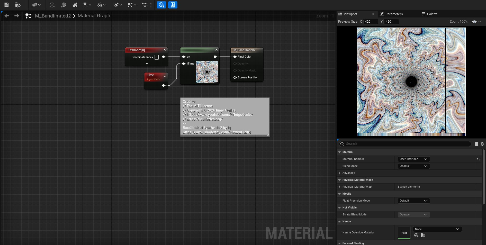
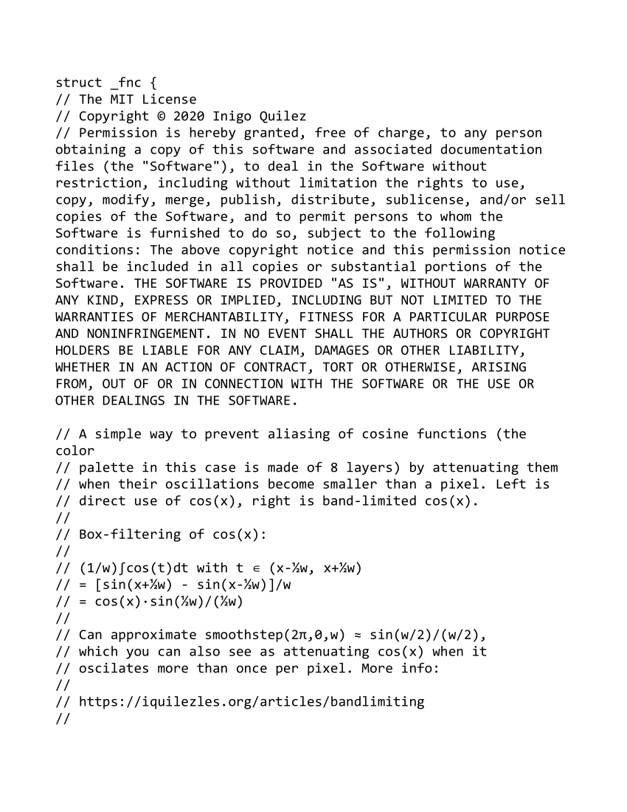
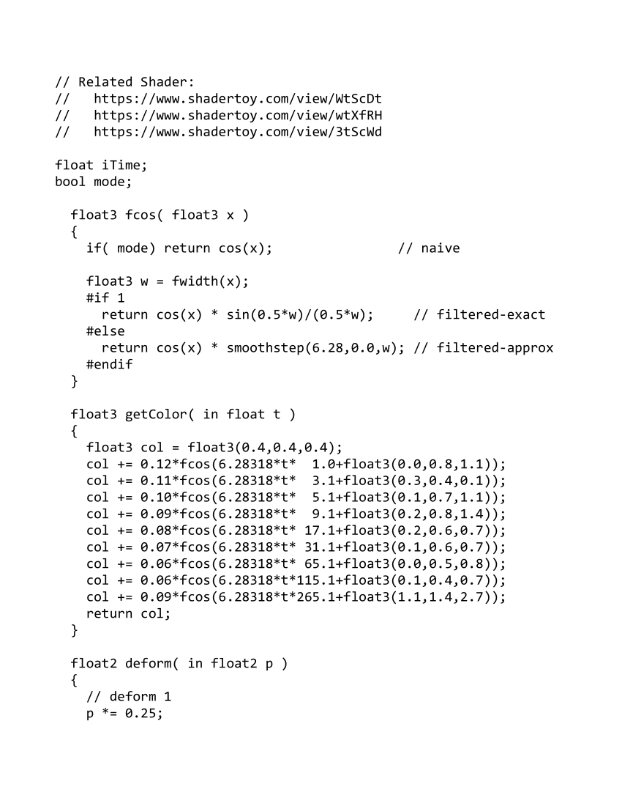
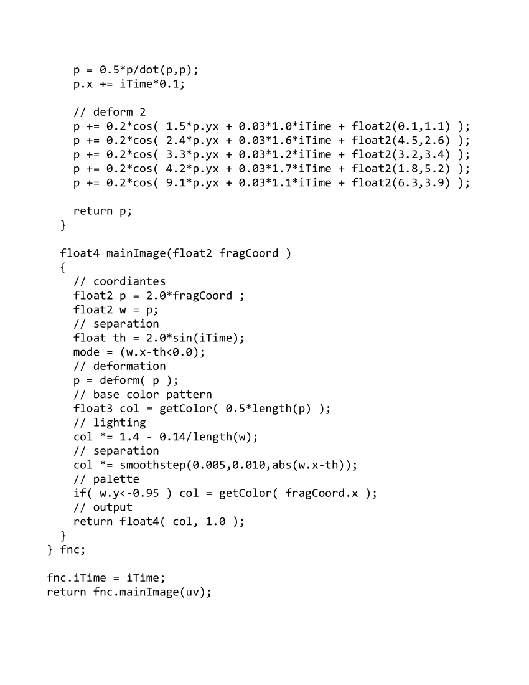

# <a href="..">UEMaterials</a> - M_Bandlimited2
 

<a href="../M_Bandlimited2.uasset">M_Bandlimited2</a> 

 
 
 
 

Credits: 
// The MIT License 
// Copyright © 2020 Inigo Quilez 
// https://www.youtube.com/c/InigoQuilez 
// https://iquilezles.org/ 
-- 
Bandlimited Synthesis 2 by iq 
<a href="https://www.shadertoy.com/view/wtXfRH">https://www.shadertoy.com/view/wtXfRH</a> 
 
Post: 
<a href="https://twitter.com/DrkFX/status/1639342470419865614">https://twitter.com/DrkFX/status/1639342470419865614</a> 