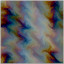

# <a href="..">UEMaterials</a> - M_Flow
 

<a href="../M_Flow.uasset">M_Flow</a> 

 
 

Credits: 
Xor 
@XorDev 
<a href="https://twitter.com/XorDev/status/1630761802337230848">https://twitter.com/XorDev/status/1630761802337230848</a> 
 
Post: 
<a href="https://twitter.com/DrkFX/status/1632989457874841600">https://twitter.com/DrkFX/status/1632989457874841600</a> 