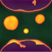

# <a href="..">UEMaterials</a> - M_LavaLamp
 

<a href="../M_LavaLamp.uasset">M_LavaLamp</a> 

 
 
 
 
 
 
 

 
Credits: 
@_Dervishh 
<a href="https://twitter.com/_Dervishh/status/1681164091577053184">https://twitter.com/_Dervishh/status/1681164091577053184</a>  
Lava Lamp Unity Shader Graph | Tutorial | English Subtitles 
<a href="https://www.youtube.com/watch?v=HmICrwj2Exo">https://www.youtube.com/watch?v=HmICrwj2Exo</a> 
 
Post: 
<a href="https://x.com/DrkFX/status/1681999989801734145">https://x.com/DrkFX/status/1681999989801734145</a> 