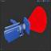

# <a href="..">UEMaterials</a> - M_LightCone
 

<a href="../BP_LightCone.uasset">BP_LightCone</a> 
<a href="../M_LightCone.uasset">M_LightCone</a> 

 
 
 

Credits: 
Epic Online Learning 
<a href="https://dev.epicgames.com/community/learning/tutorials/nR/projecting-a-texture-in-worldspace">https://dev.epicgames.com/community/learning/tutorials/nR/projecting-a-texture-in-worldspace</a> 

Post: 
<a href="https://twitter.com/DrkFX/status/1729923695844450404">https://twitter.com/DrkFX/status/1729923695844450404</a>