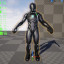

# <a href="..">UEMaterials</a> - M_MeshOverlay_Basic
 

<a href="../M_MeshOverlay_Basic.uasset">M_MeshOverlay_Basic</a> 

 

 
Credits: 
ヒストリア広報部 
@historia_Inc 
<a href="https://twitter.com/historia_Inc/status/1615666161475293184">https://twitter.com/historia_Inc/status/1615666161475293184</a> 
 
Post: 
<a href="https://twitter.com/DrkFX/status/1615980390048763906">https://twitter.com/DrkFX/status/1615980390048763906</a> 