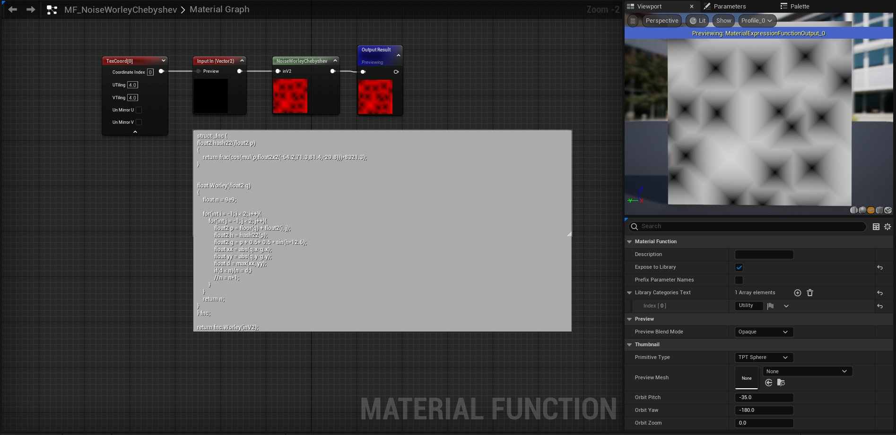

# <a href="..">UEMaterials</a> - M_NoiseWorleyChebyshev
 

<a href="../M_NoiseWorleyChebyshev.uasset">M_NoiseWorleyChebyshev</a> 

 
 

 
Credits: 
Shadertoy - dragonyhr 
<a href="https://shadertoy.com/view/tldGzr">https://shadertoy.com/view/tldGzr</a> 
 
Post: 
<a href="https://x.com/DrkFX/status/1622670231150764043">https://x.com/DrkFX/status/1622670231150764043</a> 