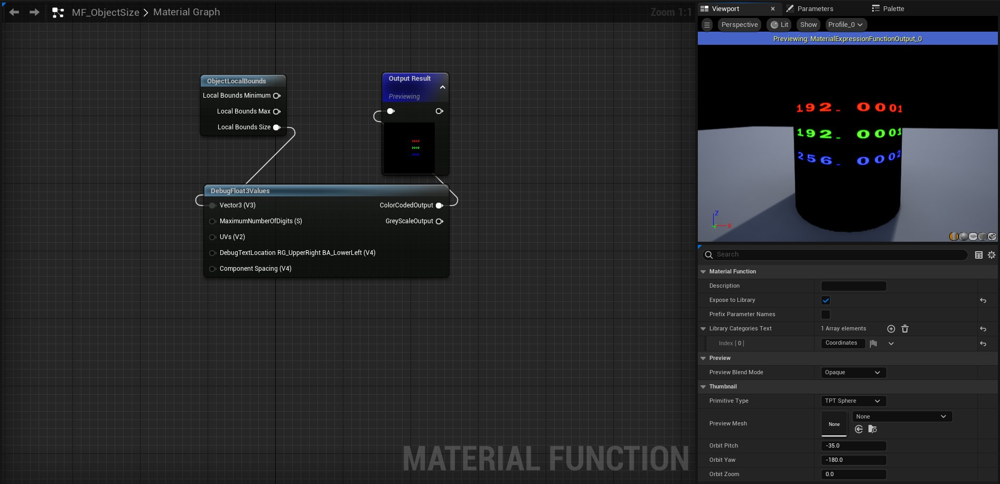
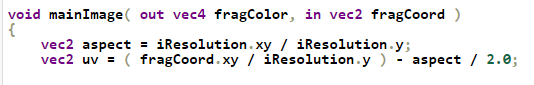

# <a href="..">UEMaterials</a> - M_ObjectSize
 

<a href="../M_ObjectSize.uasset">M_ObjectSize</a> 

 
 

 
Post: 
<a href="https://x.com/DrkFX/status/1625227870716010496">https://x.com/DrkFX/status/1625227870716010496</a> 