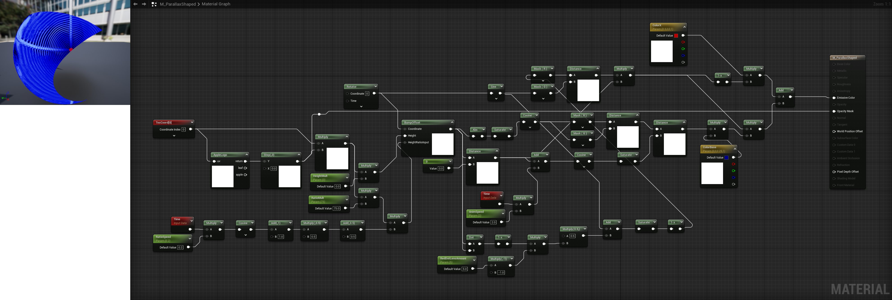
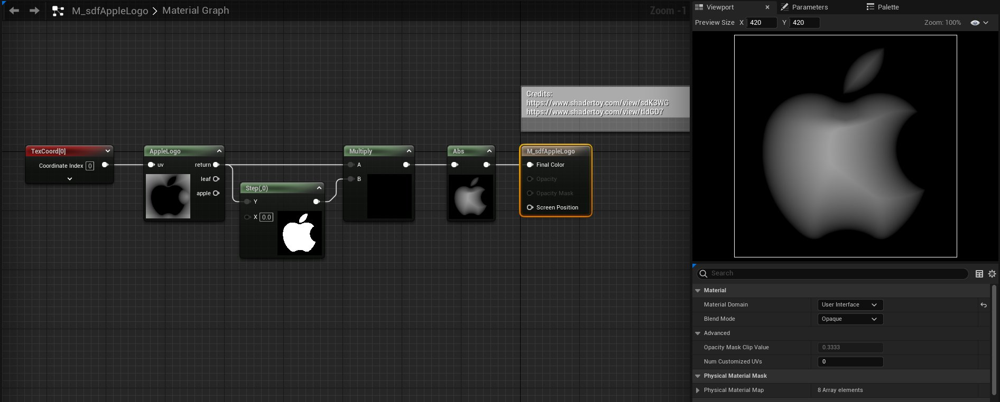
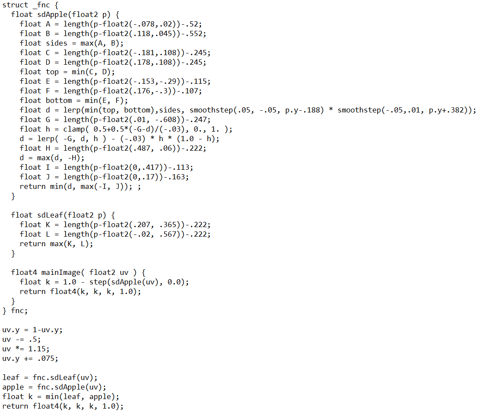

# <a href="..">UEMaterials</a> - M_ParallaxShaped
 

<a href="../M_ParallaxShaped.uasset">M_ParallaxShaped</a> 

 
 
 

 
Post: 
<a href="https://x.com/DrkFX/status/1636794856562388992">https://x.com/DrkFX/status/1636794856562388992</a> 