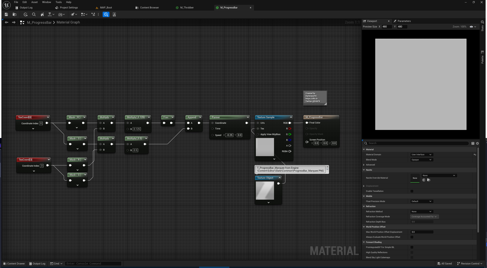

# <a href="..">UEMaterials</a> - M_ProgressBar
 

<a href="../M_ProgressBar.uasset">M_ProgressBar</a> reused engine internal marquee.png and animated it, apply to Progressbar Widget > Fill Material. 

 

 
Post: 
<a href="https://x.com/DrkFX/status/1846130662475972703">https://x.com/DrkFX/status/1846130662475972703</a> 