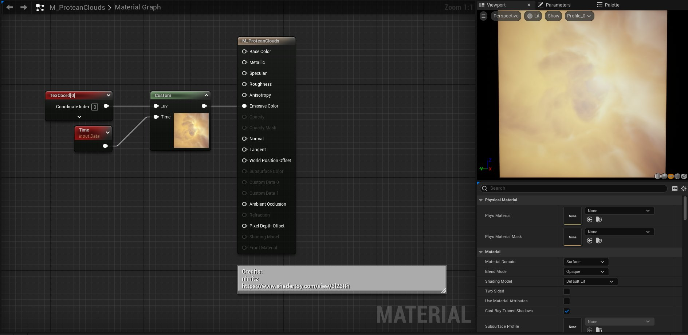
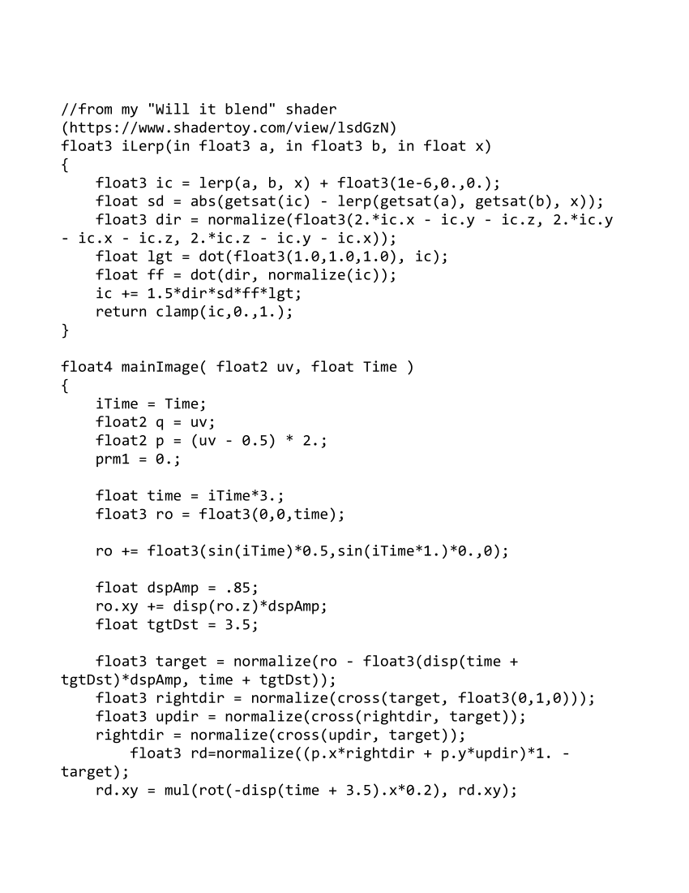
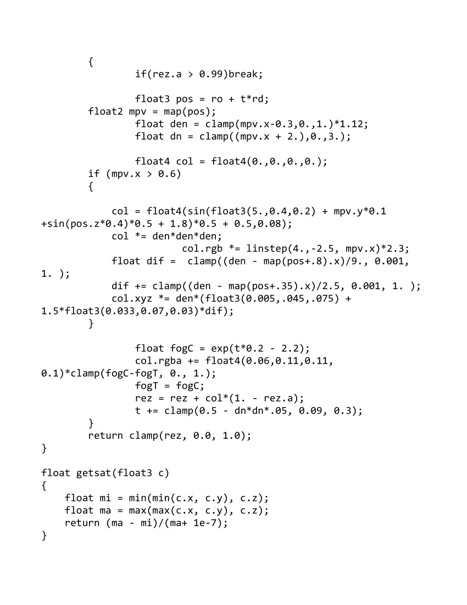
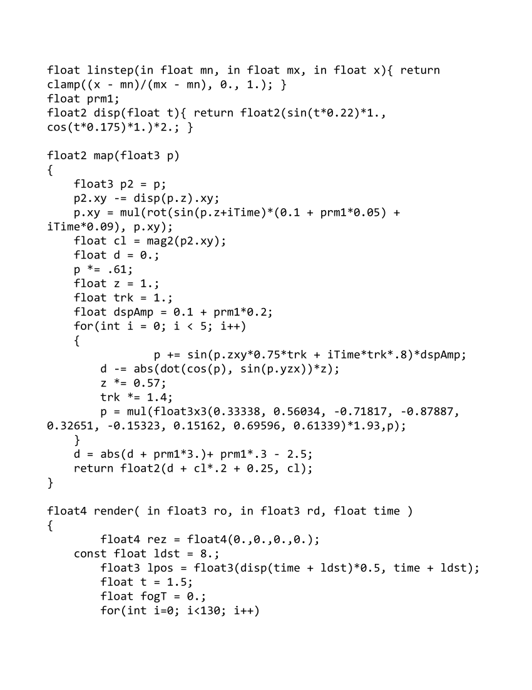
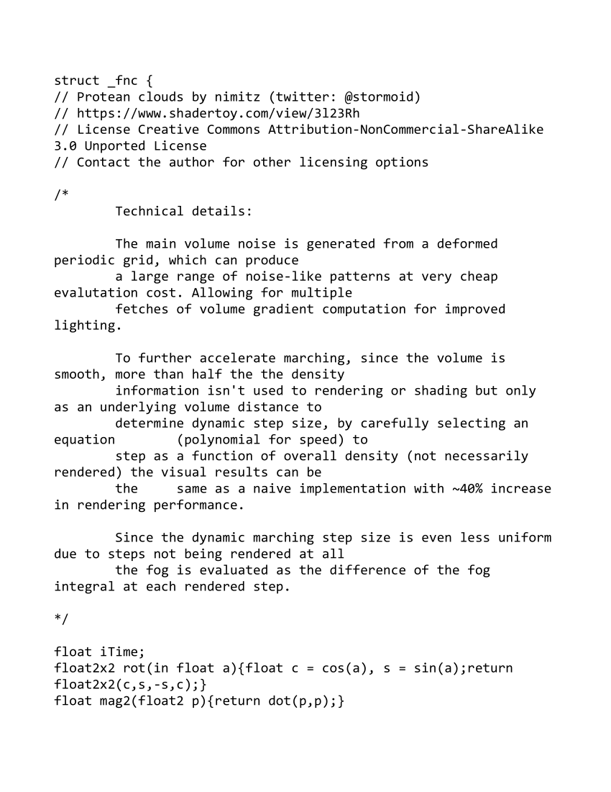

# <a href="..">UEMaterials</a> - M_ProteanClouds
 

<a href="../M_ProteanClouds.uasset">M_ProteanClouds</a> 

 
 
 
 
 
 

Credits: 
nimitz 
<a href="https://www.shadertoy.com/view/3l23Rh">https://www.shadertoy.com/view/3l23Rh</a> 
 
Post: 
<a href="https://x.com/DrkFX/status/1637889342801584147">https://x.com/DrkFX/status/1637889342801584147</a> 