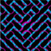
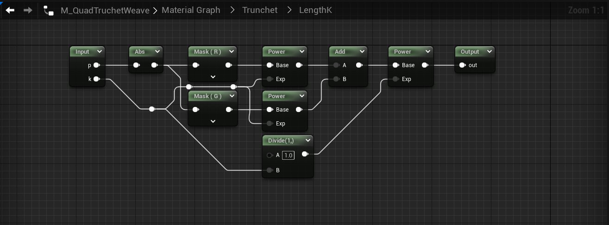

# <a href="..">UEMaterials</a> - M_QuadTruchetWeave
 

<a href="../M_QuadTruchetWeave.uasset">M_QuadTruchetWeave</a> 

 
 
 
 

Credits: 
Coding a crazy weave pattern 
@The_ArtOfCode 
<a href="https://www.youtube.com/watch?v=pmS-F6RJhAk">https://www.youtube.com/watch?v=pmS-F6RJhAk</a> 
 
Post: 
<a href="https://twitter.com/DrkFX/status/1621623379034775558">https://twitter.com/DrkFX/status/1621623379034775558</a> 