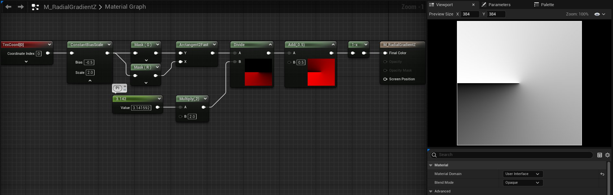

# <a href="..">UEMaterials</a> - M_RadialGradientZ
 

<a href="../M_RadialGradientZ.uasset">M_RadialGradientZ</a> 

 
 

 
Post: 
<a href="https://x.com/DrkFX/status/1608905192820592641">https://x.com/DrkFX/status/1608905192820592641</a> 