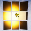

# <a href="..">UEMaterials</a> - M_Retroreflective
 

<a href="../BP_Retroreflective.uasset">BP_Retroreflective</a> 
<a href="../M_Retroreflective.uasset">M_Retroreflective</a> 

 
 

Credits: 
Epic Online Learning 
<a href="https://dev.epicgames.com/community/learning/tutorials/L2/unreal-engine-creating-a-retroreflective-material-effect">https://dev.epicgames.com/community/learning/tutorials/L2/unreal-engine-creating-a-retroreflective-material-effect</a> 
 
Post: 
<a href="https://twitter.com/DrkFX/status/1730234558300160350">https://twitter.com/DrkFX/status/1730234558300160350</a> 