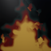
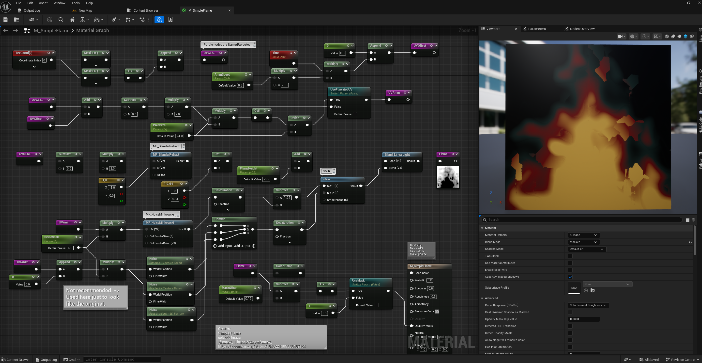

# <a href="..">UEMaterials</a> - M_SimpleFlame
 

<a href="../M_SimpleFlame.uasset">M_SimpleFlame</a> 

 

Note: 
This material use multiple Material Functions: [sMin](https://github.com/DarknessFX/UEMaterials/blob/main/sMin.uasset) , [MF_BlenderRefract](https://github.com/DarknessFX/UEMaterials/blob/main/MF_BlenderRefract.uasset) , [MF_NoiseMinkowski](https://github.com/DarknessFX/UEMaterials/blob/main/MF_NoiseMinkowski.uasset) .

Post: 
[https://x.com/DrkFX/status/1969122746530472205](https://x.com/DrkFX/status/1969122746530472205)  

Credits: 
Simple Flame  
celestialmaze  
 @cmzw_  |  [https://x.com/cmzw_](https://x.com/cmzw_)  
[https://x.com/cmzw_/status/1540221309585457154](https://x.com/cmzw_/status/1540221309585457154)  
