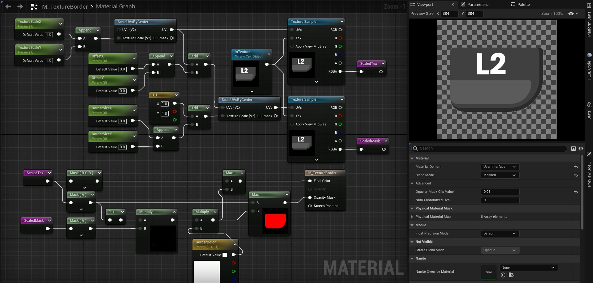

# <a href="..">UEMaterials</a> - M_UI_TextureBorder
 

<a href="../M_UI_TextureBorder.uasset">M_UI_TextureBorder</a> 

 

 
Post: 
<a href="https://x.com/DrkFX/status/1616969249720762368">https://x.com/DrkFX/status/1616969249720762368</a> 