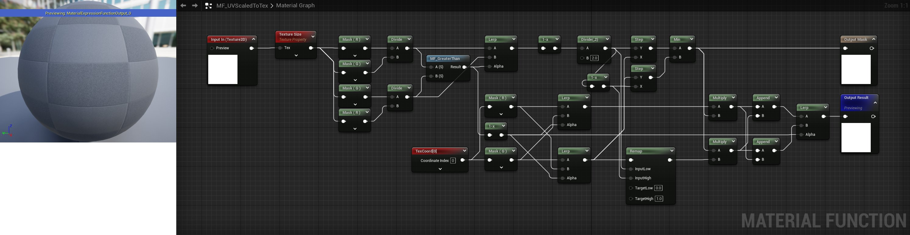
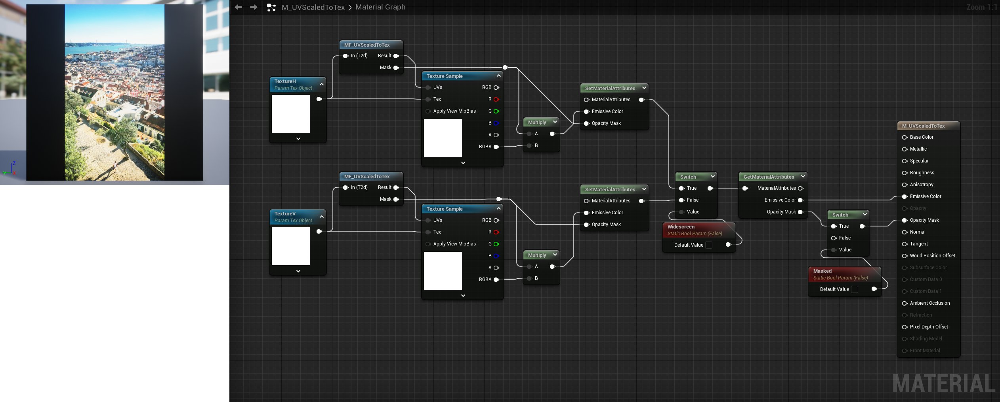

# <a href="..">UEMaterials</a> - M_UVScaledToTex
 

<a href="../M_UVScaledToTex.uasset">M_UVScaledToTex</a> 

 
 

 
Post: 
<a href="https://twitter.com/DrkFX/status/1636525909183287296">https://twitter.com/DrkFX/status/1636525909183287296</a> 