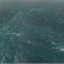

# <a href="..">UEMaterials</a> - M_Waves
 

<a href="../M_Waves.uasset">M_Waves</a> 

 
 
 

Credits: 
yonatan 
@zozuar 
<a href="https://twitter.com/zozuar/status/1632160439944478721">https://twitter.com/zozuar/status/1632160439944478721</a> 
 
Post: 
<a href="https://x.com/DrkFX/status/1633009094012329985">https://x.com/DrkFX/status/1633009094012329985</a> 